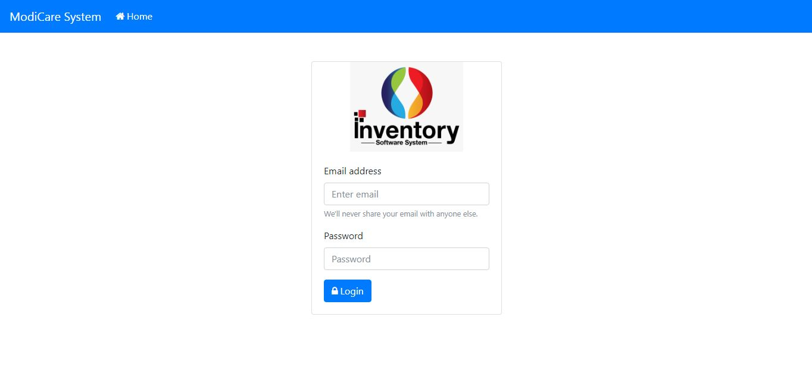
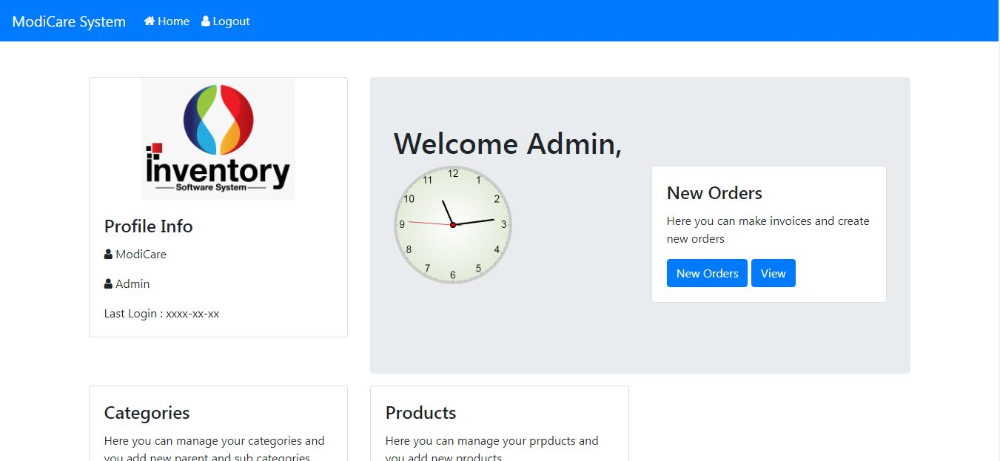
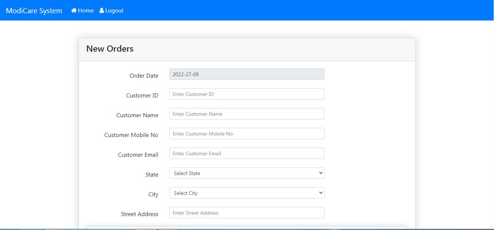
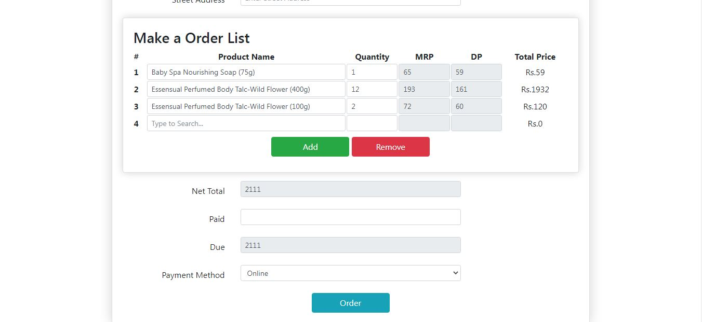
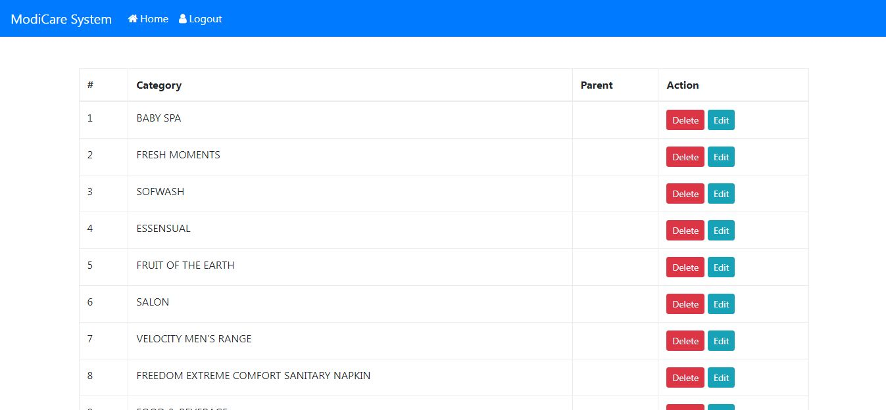
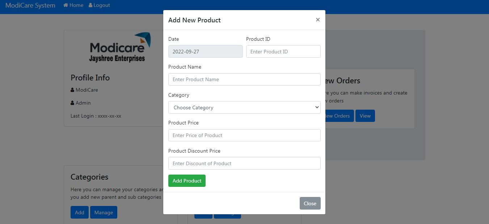
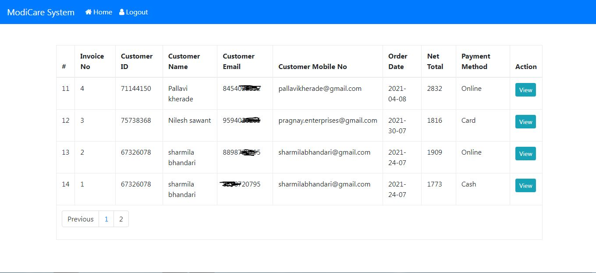
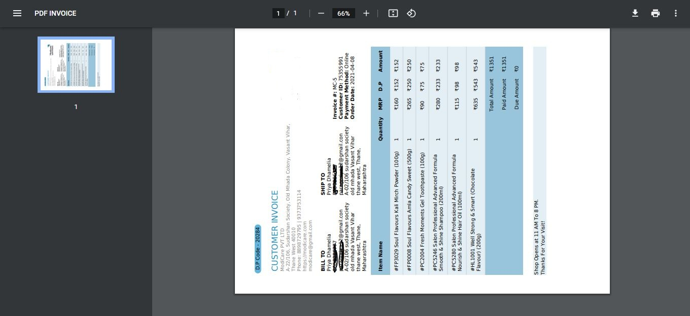

# Inventory Management System
This Inventory Management System was develop using PHP and MySQL Database. It is a simple system created using HTML, CSS design, JavaScript, Bootstrap, and Ajax. This Inventory management system is all about selling products. 

It is a simple project that monitors the stock quantity. This system has a pleasant user interface and it is user-friendly. The system generates reports for the list of Items, Sales, Customer, and Purchases. Each of these reports can be printed and exported to PDF.

## How to Run This Project
- Extract the File
- Copy the extracted folder to XAMPP's "htdocs" directory. (C:\xampp\htdocs)
- Open a web browser and browse the PHPMyAdmin. (http://localhost/phpmyadmin)
- Create a new database naming "invoice".
- Import the SQL file. The SQL file is known as "invoice.sql" and this is located at the "database" directory of the extracted folder.
- Open a web browser and browse the web application. (http://localhost/inventory-management-system)

### Sample Access
- Username: admin@gmail.com
- Password: admin@gmail.com

## Screenshots

## Developed By
- Swarup Kanade [@swarupkanade](https://www.github.com/swarupkanade)
- Omkar Kanade [@omkarkanade](https://www.github.com/omkarkanade)